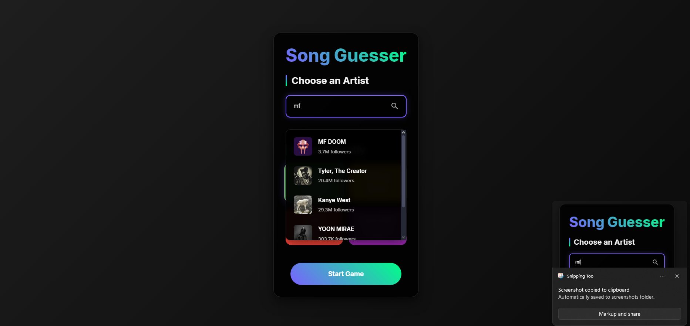
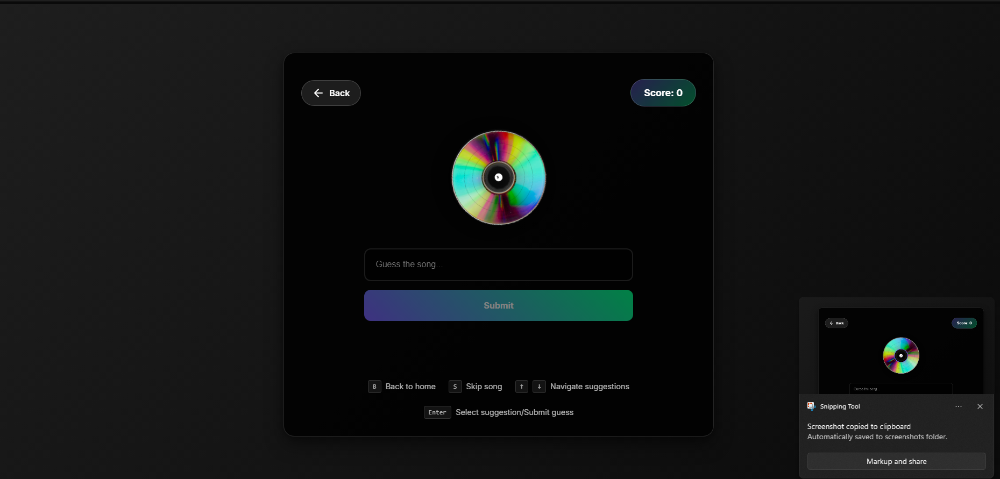
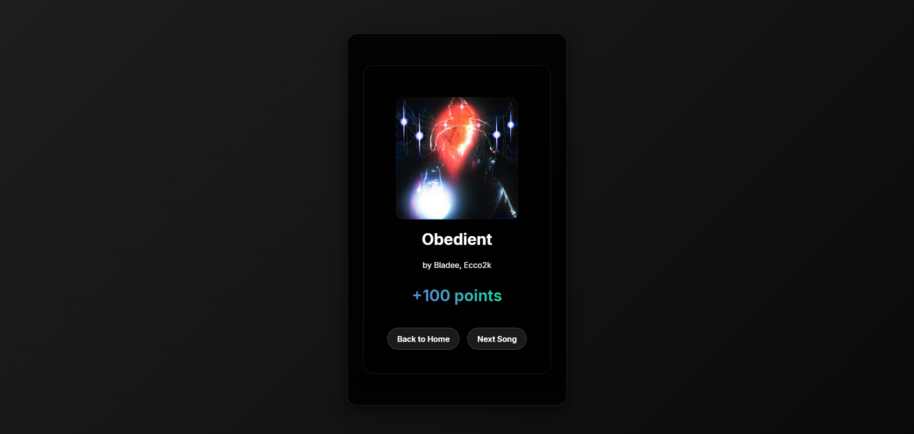

# Music Song Guesser

A web application that tests your music knowledge by challenging you to identify songs from your favorite artists based on short snippets using the iTunes API.

## Features

- **iTunes API Integration**: Access artist and song data from the iTunes Search API.
- **Artist Search**: Search for any artist available on iTunes.
- **Multiple Difficulty Levels**: 
  - Easy: 5 seconds of playback
  - Medium: 3 seconds of playback
  - Hard: 1 second of playback
  - Impossible: 0.5 seconds of playback
- **Song Suggestions**: Type-ahead suggestions for song guesses.
- **Score Tracking**: Keep track of your points as you play.
- **Responsive Design**: Works on both desktop and mobile devices.
- **Keyboard Shortcuts**: Streamlined gameplay with keyboard controls.

## Demo

### [Live Demo](https://spotify-guess-game-public.vercel.app/) 
*(Note: Demo link might be outdated, reflecting previous Spotify version)*

**Note:** This app uses the public iTunes API and does not require user login or special authentication for basic gameplay.

## Screenshots

*(Screenshots need to be updated to reflect current iTunes version)*

| Artist select | Guess screen |Results Screen |
|:--------:|:-------------:|
|  |  | |

## How to Play

1. Search for and select an artist (or choose Top Charts).
2. Choose your difficulty level.
3. Listen to the snippet and guess the song.
4. Earn points for correct guesses!

## Technical Overview

### Built With

- [React](https://reactjs.org/) - Frontend framework
- [TypeScript](https://www.typescriptlang.org/) - Static typing
- [React Router](https://reactrouter.com/) - Navigation
- [iTunes Search API](https://developer.apple.com/library/archive/documentation/AudioVideo/Conceptual/iTuneSearchAPI/index.html) - Music data
- HTML5 Audio - For music snippet playback

### Project Structure (Simplified)

```
spotify-guess-game/ 
├── src/
│   ├── components/
│   │   └── ITunesPlayer.tsx      # Custom HTML5 audio player component
│   ├── hooks/
│   │   └── useITunes.ts          # Hook for iTunes data fetching
│   ├── pages/
│   │   ├── GamePage.tsx            # Main game interface
│   │   ├── HomePage.tsx            # Artist selection screen
│   │   └── LoadingPage.tsx         # Loading screen component
│   ├── styles/                     # CSS files
│   └── utils/
│       └── itunesApi.ts            # iTunes API wrapper
└── ...
```

## Installation

### Prerequisites

- Node.js (v14 or later)
- npm or yarn

### Setup

1. Clone the repository
   ```bash
   git clone https://github.com/smiki25/spotify-guess-game-public.git
   cd spotify-guess-game 
   ```

2. Install dependencies
   ```bash
   npm install
   # or
   yarn install
   ```

3. Create a `.env` file in the root directory (Optional - no API keys needed for basic iTunes functionality).
   If you plan to extend with other services requiring keys, you can add them here, e.g.:
   ```
   # VITE_SOME_OTHER_API_KEY=your_api_key
   ```
   Currently, no environment variables are strictly required for the iTunes song guessing game to run locally.

4. Start the development server
   ```bash
   npm run dev
   # or
   yarn dev
   ```

## Deployment

### Building for Production

```bash
npm run build
# or
yarn build
```

The build artifacts will be stored in the `dist/` directory.

## Development Notes

### API Usage

The app uses the publicly available iTunes Search API to fetch artist and song data. No complex authentication flow is required for this.

### Player Implementation

The music player is implemented using the native HTML5 `<audio>` element, controlled via React state and refs. This allows for precise snippet duration control.


## Acknowledgements

- [Apple iTunes Search API](https://developer.apple.com/library/archive/documentation/AudioVideo/Conceptual/iTuneSearchAPI/index.html) for providing music data.
- [React](https://reactjs.org/) and its ecosystem.
- All the open-source contributors whose libraries made this possible.
